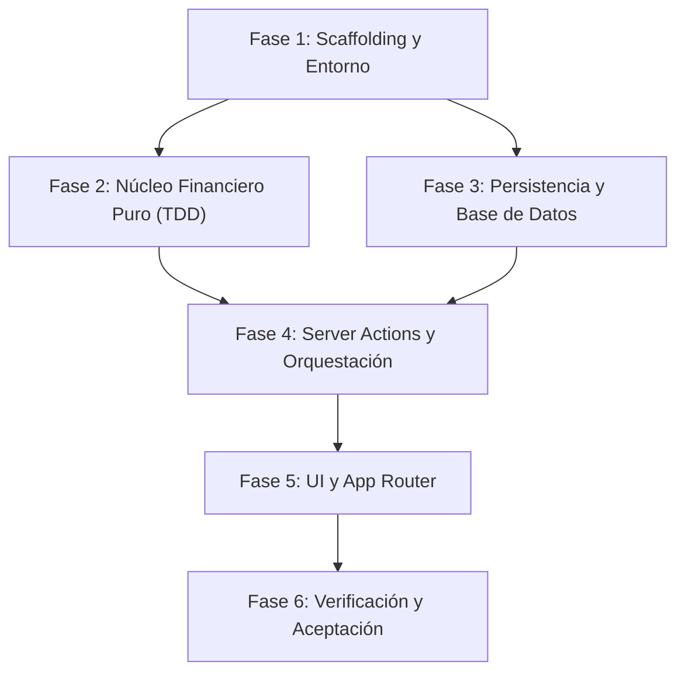

# Desglose de Tareas de Implementación: Flujo MVP (001-flujo-mvp)

Este documento contiene el desglose granular y secuencial de tareas para la implementación del MVP de **Flujo**, estructurado a partir de [spec.md](file:///d:/antigravity/Flujo/specs/001-flujo-mvp/spec.md), [plan.md](file:///d:/antigravity/Flujo/specs/001-flujo-mvp/plan.md), [constitution.md](file:///d:/antigravity/Flujo/docs/constitution.md) y [AGENTS.md](file:///d:/antigravity/Flujo/AGENTS.md).

---

## 1. Criterios de Asignación: Tareas de IA vs Tareas de Humano

Para garantizar un desarrollo ágil, seguro y con supervisión adecuada, las tareas se dividen según su ejecutor natural:

### 1.1 Tareas Asignables a la Inteligencia Artificial (IA) `[IA]`

- **Scaffolding y configuración de herramientas:** Inicialización del proyecto Next.js, configuración de TypeScript en modo estricto, Tailwind CSS, Prettier, ESLint y Vitest.
- **Desarrollo de lógica pura en TDD (`src/core/`):** Escritura de pruebas unitarias y funciones puras de cálculo financiero (aritmética en centavos, redondeo `HALF_UP`, validación de calendario gregoriano, métricas de sobregiro y sanitización de entradas).
- **Capa de persistencia (`src/db/`):** Definición de esquemas relacionales Drizzle ORM, índices, restricciones de integridad referencial, scripts de migración y seed inicial.
- **Orquestación y Server Actions (`src/actions/`):** Controladores de servidor con esquemas de validación Zod, transacciones atómicas de base de datos y respuestas tipadas `ActionResult<T>`.
- **Componentes de Interfaz de Usuario (`src/components/`, `src/app/`):** Construcción de vistas, layouts, componentes visuales accesibles y modales interactivos siguiendo el sistema de diseño.
- **Ejecución y resolución de pruebas y linters:** Ejecución automatizada de `npm run test`, `npm run lint` y corrección de advertencias o errores de compilación.

### 1.2 Tareas Exclusivas de un Humano `[Humano]`

- **Aprobación de especificaciones y arquitectura:** Validación formal de [spec.md](file:///d:/antigravity/Flujo/specs/001-flujo-mvp/spec.md) y [plan.md](file:///d:/antigravity/Flujo/specs/001-flujo-mvp/plan.md) antes de iniciar la codificación (Principio 2 de la Constitución).
- **Decisiones sobre alcance o cambios de requisitos:** Resolución de dudas no cubiertas en la especificación activa.
- **Pruebas de aceptación de usuario (UAT) en navegador:** Comprobación interactiva del flujo completo en un navegador real (sensación de uso, legibilidad, flujos de sobregiro y navegación temporal).
- **Aprobación formal de cierre y entrega:** Certificación de que el MVP cumple todas las expectativas antes del despliegue o pase a producción.

---

## 2. Mapa de Dependencias entre Fases

---

## 3. Desglose Secuencial de Tareas

> **Regla de ejecución:** Cada tarea tiene una duración estimada de **15 a 30 minutos**. No se puede dar por cerrada una tarea si su condición **"Hecho cuando:"** no se encuentra completamente verificada.

---

### Fase 1: Inicialización del Entorno y Scaffolding Base

- [x] **TASK-01: Aprobación formal del plan técnico y especificación**
  - **Ejecutor:** Humano
  - **Estimación:** 15 min
  - **Dependencias:** Ninguna
  - **RF que cubre:** Principio 2 de la Constitución
  - **Descripción:** Revisar y dar visto bueno a [spec.md](file:///d:/antigravity/Flujo/specs/001-flujo-mvp/spec.md) y [plan.md](file:///d:/antigravity/Flujo/specs/001-flujo-mvp/plan.md), confirmando que las reglas de cálculo, casos límite y arquitectura satisfacen los objetivos del MVP.
  - **Hecho cuando:** El usuario humano confirma explícitamente en el hilo de trabajo la aprobación del plan sin objeciones pendientes.

- [x] **TASK-02: Inicialización de proyecto Next.js con TypeScript y Tailwind CSS**
  - **Ejecutor:** IA
  - **Estimación:** 20 min
  - **Dependencias:** TASK-01
  - **RF que cubre:** RNF-3, Principio 1 de la Constitución, AGENTS.md
  - **Descripción:** Ejecutar la inicialización en el directorio raíz usando `create-next-app` con App Router, TypeScript en modo estricto (`strict: true`), Tailwind CSS y ESLint.
  - **Hecho cuando:** Los archivos `package.json`, `tsconfig.json` (con `"strict": true`) y `tailwind.config.ts` existan y `npm run build` o `npm run dev` compile sin errores.

- [x] **TASK-03: Configuración de Prettier y scripts de calidad en `package.json`**
  - **Ejecutor:** IA
  - **Estimación:** 15 min
  - **Dependencias:** TASK-02
  - **RF que cubre:** AGENTS.md
  - **Descripción:** Configurar `.prettierrc`, `.prettierignore` y añadir a `package.json` los scripts requeridos por AGENTS.md: `npm run lint`, `npm run format:check` (`npx prettier --check .`) y `npm run format:write` (`npx prettier --write .`).
  - **Hecho cuando:** `npx prettier --check .` y `npm run lint` se ejecuten exitosamente por comando en la terminal sin fallas de configuración.

- [ ] **TASK-04: Configuración del entorno de pruebas con Vitest**
  - **Ejecutor:** IA
  - **Estimación:** 20 min
  - **Dependencias:** TASK-02
  - **RF que cubre:** Principio 4 de la Constitución, AGENTS.md
  - **Descripción:** Instalar `vitest` y dependencias de testing ligero, crear `vitest.config.ts` con alias de path `@/*` alineados con `tsconfig.json` y agregar el script `npm run test`.
  - **Hecho cuando:** Ejecutar `npm run test` ejecute Vitest correctamente (mostrando al menos un test de prueba inicial en verde).

- [ ] **TASK-05: Configuración de SQLite local y Drizzle ORM**
  - **Ejecutor:** IA
  - **Estimación:** 25 min
  - **Dependencias:** TASK-02
  - **RF que cubre:** RNF-5, Principio 1 de la Constitución
  - **Descripción:** Instalar `drizzle-orm`, `drizzle-kit`, `better-sqlite3` y `@types/better-sqlite3`. Crear `drizzle.config.ts` apuntando al archivo de base de datos local SQLite y configurar los scripts `db:generate` y `db:push` en `package.json`.
  - **Hecho cuando:** `drizzle.config.ts` esté creado y `npx drizzle-kit --version` responda correctamente en la terminal.

---

### Fase 2: Núcleo Financiero Puro (`src/core/`) [TDD]

- [ ] **TASK-06: Definición de tipos de dominio financiero en `src/core/types.ts`**
  - **Ejecutor:** IA
  - **Estimación:** 20 min
  - **Dependencias:** TASK-02
  - **RF que cubre:** RF-1 (CA-1.1), RF-4 (CA-4.4), RF-5 (CA-5.1), RNF-3
  - **Descripción:** Crear `src/core/types.ts` con tipos puros en inglés: `TransactionType` (`'income' | 'expense'`), `Category`, `MonthlyBudget`, `Transaction`, `CategoryStatus` (`'normal' | 'overbudget' | 'unbudgeted_expense' | 'unbudgeted_income' | 'unbudgeted_idle'`) y `SummaryDeviation` (`'favorable' | 'unfavorable' | 'neutral'`). Prohibido importar dependencias de React o BD.
  - **Hecho cuando:** `src/core/types.ts` compile con `npx tsc --noEmit` sin arrojar ningún error de tipos.

- [ ] **TASK-07: Pruebas unitarias para aritmética monetaria y redondeo HALF_UP**
  - **Ejecutor:** IA
  - **Estimación:** 20 min
  - **Dependencias:** TASK-04, TASK-06
  - **RF que cubre:** RNF-1, RNF-2, Principio 4 de la Constitución
  - **Descripción:** Escribir en `tests/unit/money.test.ts` casos de prueba exhaustivos para: conversión decimal a centavos enteros, centavos a string formateado (`$1,250.00`, `-$350.50`, `$0.00`), rechazo de más de 2 decimales y algoritmo `roundHalfUp` con casos de tercio (`33.33%`), mitad y valores periódicos.
  - **Hecho cuando:** `npm run test tests/unit/money.test.ts` falle inicialmente solo por ausencia de la implementación (fase roja del TDD).

- [ ] **TASK-08: Implementación de aritmética de centavos y formateo en `src/core/money.ts`**
  - **Ejecutor:** IA
  - **Estimación:** 25 min
  - **Dependencias:** TASK-07
  - **RF que cubre:** RNF-1, RNF-2
  - **Descripción:** Implementar funciones puras en `src/core/money.ts`: `centsToCurrencyString(cents: number): string`, `currencyStringToCents(amount: string): number`, `roundHalfUp(value: number, decimals: number): number` y validación estricta de formato decimal.
  - **Hecho cuando:** `npm run test tests/unit/money.test.ts` pase al 100% en verde sin advertencias.

- [ ] **TASK-09: Pruebas unitarias para validación temporal y fronteras de calendario**
  - **Ejecutor:** IA
  - **Estimación:** 20 min
  - **Dependencias:** TASK-04, TASK-06
  - **RF que cubre:** RF-3 (CA-3.3), RF-5 (CA-5.2), RNF-6
  - **Descripción:** Escribir en `tests/unit/dates.test.ts` pruebas para: validación del patrón `YYYY-MM-DD`, validación estricta de días reales en calendario gregoriano (ej. rechazo de `2026-02-29` y aceptación de `2024-02-29`), rechazo de fechas anteriores a `2000-01-01`, rechazo de fechas futuras respecto a una fecha de referencia inyectada, y validación de horizonte navegable (`2000-01` hasta diciembre de año actual + 1).
  - **Hecho cuando:** `npm run test tests/unit/dates.test.ts` falle inicialmente por ausencia de funciones en el core (fase roja TDD).

- [ ] **TASK-10: Implementación de reglas de calendario y navegación en `src/core/dates.ts`**
  - **Ejecutor:** IA
  - **Estimación:** 25 min
  - **Dependencias:** TASK-09
  - **RF que cubre:** RF-3 (CA-3.3), RF-5 (CA-5.2), RNF-6
  - **Descripción:** Implementar funciones puras en `src/core/dates.ts`: `isValidDateString(dateStr: string): boolean`, `validateTransactionDate(dateStr: string, referenceDate: string): ValidationResult`, `validatePeriodNavigation(yearMonth: string, referenceDate: string): PeriodNavigationResult` y helpers para extraer `yearMonth` de una fecha.
  - **Hecho cuando:** `npm run test tests/unit/dates.test.ts` pase al 100% en verde.

- [ ] **TASK-11: Pruebas unitarias de cálculo de métricas por categoría**
  - **Ejecutor:** IA
  - **Estimación:** 25 min
  - **Dependencias:** TASK-08
  - **RF que cubre:** RF-4 (CA-4.1, CA-4.2, CA-4.3, CA-4.4), Casos límite 1 a 4
  - **Descripción:** Escribir en `tests/unit/metrics.test.ts` casos de prueba para: gastos normales (disponible positivo, porcentaje con 2 decimales `HALF_UP`), límite exacto alcanzado (100.00% y disponible $0.00), sobregiro con presupuesto asignado (`overbudget` con disponible negativo y porcentaje > 100%), gasto sin presupuesto (`unbudgeted_expense` con porcentaje `null/N/A`), estado inactivo sin presupuesto (`unbudgeted_idle`), e ingresos presupuestados y no presupuestados (`unbudgeted_income`).
  - **Hecho cuando:** `npm run test tests/unit/metrics.test.ts` falle inicialmente por ausencia de la función de cálculo (fase roja TDD).

- [ ] **TASK-12: Implementación de métricas de categoría en `src/core/metrics.ts`**
  - **Ejecutor:** IA
  - **Estimación:** 25 min
  - **Dependencias:** TASK-11
  - **RF que cubre:** RF-4 (CA-4.1 a CA-4.4)
  - **Descripción:** Implementar `calculateCategoryMetrics(type: TransactionType, budgetCents: number, actualCents: number): CategoryMetrics` en `src/core/metrics.ts` cumpliendo con las especificaciones matemáticas del pseudocódigo 3.2 de [plan.md](file:///d:/antigravity/Flujo/specs/001-flujo-mvp/plan.md).
  - **Hecho cuando:** Todas las pruebas de métricas en `tests/unit/metrics.test.ts` pasen en verde.

- [ ] **TASK-13: Pruebas unitarias de resumen consolidado mensual y desviaciones**
  - **Ejecutor:** IA
  - **Estimación:** 20 min
  - **Dependencias:** TASK-12
  - **RF que cubre:** RF-2 (CA-2.6), RF-5 (CA-5.1)
  - **Descripción:** Añadir a `tests/unit/metrics.test.ts` pruebas para `calculateMonthlySummary`: agregación de ingresos planificados, gastos planificados, balance presupuestado neto, totales reales de ingreso y gasto, balance real neto y cálculo de desviación neta (`favorable`, `unfavorable` o `neutral`).
  - **Hecho cuando:** Las pruebas de agregación mensual fallen inicialmente por ausencia de `calculateMonthlySummary`.

- [ ] **TASK-14: Implementación de resumen consolidado en `src/core/metrics.ts`**
  - **Ejecutor:** IA
  - **Estimación:** 20 min
  - **Dependencias:** TASK-13
  - **RF que cubre:** RF-2 (CA-2.6), RF-5 (CA-5.1)
  - **Descripción:** Implementar `calculateMonthlySummary(items: CategoryMetricsItem[]): MonthlySummary` en `src/core/metrics.ts` según el algoritmo 3.3 de [plan.md](file:///d:/antigravity/Flujo/specs/001-flujo-mvp/plan.md).
  - **Hecho cuando:** `npm run test tests/unit/metrics.test.ts` pase al 100% en verde con todos los casos de resumen cubiertos.

- [ ] **TASK-15: Pruebas unitarias de validadores y reglas de integridad en `tests/unit/validators.test.ts`**
  - **Ejecutor:** IA
  - **Estimación:** 20 min
  - **Dependencias:** TASK-04, TASK-06
  - **RF que cubre:** RF-1 (CA-1.3, CA-1.6, CA-1.7), RF-3 (CA-3.1, CA-3.2)
  - **Descripción:** Escribir pruebas unitarias para: validación y recorte de nombre de categoría (1 a 50 caracteres, rechazo de cadenas vacías/solo espacios), normalización de notas (sustitución de `\n`, `\r`, `\t` por espacio, trim y tope de 250 caracteres), validación de montos monetarios (> 0 y <= 999,999,999.99), y función pura `canDeleteCategory(hasTransactions: boolean, maxBudgetCents: number)`.
  - **Hecho cuando:** `npm run test tests/unit/validators.test.ts` falle por ausencia de implementación.

- [ ] **TASK-16: Implementación de validadores puros en `src/core/validators.ts`**
  - **Ejecutor:** IA
  - **Estimación:** 25 min
  - **Dependencias:** TASK-15
  - **RF que cubre:** RF-1 (CA-1.3, CA-1.6, CA-1.7), RF-3 (CA-3.1, CA-3.2)
  - **Descripción:** Implementar en `src/core/validators.ts`: `validateCategoryName`, `normalizeNote`, `validateTransactionAmount` y `canDeleteCategory` respetando las reglas de los algoritmos 3.5 y 3.6 de [plan.md](file:///d:/antigravity/Flujo/specs/001-flujo-mvp/plan.md).
  - **Hecho cuando:** `npm run test tests/unit/validators.test.ts` pase al 100% en verde.

---

### Fase 3: Persistencia Local y Esquema Relacional (`src/db/`)

- [ ] **TASK-17: Definición del esquema Drizzle en `src/db/schema.ts`**
  - **Ejecutor:** IA
  - **Estimación:** 25 min
  - **Dependencias:** TASK-05, TASK-06
  - **RF que cubre:** RF-1 (CA-1.1, CA-1.4), RF-2 (CA-2.1), RF-3 (CA-3.1, CA-3.4), RNF-3, RNF-5
  - **Descripción:** Definir en `src/db/schema.ts` las tablas `categories`, `monthly_budgets` y `transactions` con sus claves foráneas con `onDelete: 'restrict'`, índices únicos compuestos (`name + type` para categorías, `category_id + year_month` para presupuestos) e índices por período y fecha.
  - **Hecho cuando:** `npx drizzle-kit generate` cree con éxito el archivo de migración SQL sin advertencias de esquema.

- [ ] **TASK-18: Configuración de conexión SQLite local en `src/db/index.ts`**
  - **Ejecutor:** IA
  - **Estimación:** 20 min
  - **Dependencias:** TASK-17
  - **RF que cubre:** RNF-5
  - **Descripción:** Crear cliente singleton Drizzle con `better-sqlite3` en `src/db/index.ts`, habilitando WAL mode (`PRAGMA journal_mode = WAL;`) y claves foráneas (`PRAGMA foreign_keys = ON;`) para integridad referencial.
  - **Hecho cuando:** Un script de prueba conecte a la base de datos local SQLite y ejecute las migraciones pendientes automáticamente.

- [ ] **TASK-19: Implementación de script de inicialización y catálogo base en `src/db/seed.ts`**
  - **Ejecutor:** IA
  - **Estimación:** 20 min
  - **Dependencias:** TASK-18
  - **RF que cubre:** RF-1 (CA-1.2)
  - **Descripción:** Implementar función idempotente de inicialización que inserte el catálogo predeterminado si no existen categorías: Gastos (`Alimentación`, `Vivienda`, `Transporte`, `Servicios`, `Salud`, `Ocio`) e Ingresos (`Salario`, `Otros`).
  - **Hecho cuando:** Al ejecutarse el seed en una base de datos vacía, existan exactamente las 8 categorías predeterminadas; en ejecuciones posteriores, no duplique registros.

- [ ] **TASK-20: Pruebas de integración para categorías en `tests/integration/categories.test.ts`**
  - **Ejecutor:** IA
  - **Estimación:** 25 min
  - **Dependencias:** TASK-18, TASK-19
  - **RF que cubre:** RF-1 (CA-1.2, CA-1.4, CA-1.6, CA-1.7), Casos límite 5, 6, 7
  - **Descripción:** Escribir pruebas de integración sobre SQLite en memoria para: inserción de semilla, unicidad insensible a mayúsculas/minúsculas por tipo, permiso de nombre repetido en diferente tipo (`Otros`), edición con cambio de mayúsculas ("comida" a "Comida"), y bloqueo de eliminación si existen transacciones o presupuestos `> 0`.
  - **Hecho cuando:** `npm run test tests/integration/categories.test.ts` pase al 100% en verde.

- [ ] **TASK-21: Pruebas de integración para presupuestos en `tests/integration/budgets.test.ts`**
  - **Ejecutor:** IA
  - **Estimación:** 20 min
  - **Dependencias:** TASK-18
  - **RF que cubre:** RF-2 (CA-2.1, CA-2.2, CA-2.4)
  - **Descripción:** Escribir pruebas de integración sobre SQLite en memoria para: asignación de presupuesto por categoría en un mes, verificación de aislamiento mensual (mes siguiente permanece en `$0.00` sin arrastre), y restablecimiento de presupuesto al asignar `$0.00`.
  - **Hecho cuando:** `npm run test tests/integration/budgets.test.ts` pase al 100% en verde.

- [ ] **TASK-22: Pruebas de integración para transacciones en `tests/integration/transactions.test.ts`**
  - **Ejecutor:** IA
  - **Estimación:** 25 min
  - **Dependencias:** TASK-18
  - **RF que cubre:** RF-3 (CA-3.4, CA-3.5, CA-3.6, CA-3.7), Casos límite 11, 12
  - **Descripción:** Escribir pruebas de integración para: creación de transacción vinculada a categoría con derivación de tipo, traslado de mes al editar la fecha (recálculo en ambos períodos), rechazo al intentar reasignar una categoría de tipo contrario, y eliminación de la última transacción regresando el mes a estado sin movimientos.
  - **Hecho cuando:** `npm run test tests/integration/transactions.test.ts` pase al 100% en verde.

---

### Fase 4: Server Actions y Lógica de Orquestación (`src/actions/`)

- [ ] **TASK-23: Definición del contrato común de Server Actions en `src/actions/types.ts`**
  - **Ejecutor:** IA
  - **Estimación:** 15 min
  - **Dependencias:** TASK-06
  - **RF que cubre:** RNF-3, Principio 3 de la Constitución
  - **Descripción:** Definir el tipo discriminado `ActionResult<T>` (`{ success: true; data: T } | { success: false; error: string; fieldErrors?: Record<string, string[]> }`) y tipos DTO de respuesta para la interfaz de usuario.
  - **Hecho cuando:** `src/actions/types.ts` compile limpiamente con `npx tsc --noEmit`.

- [ ] **TASK-24: Implementación de Server Actions de categorías en `src/actions/categories.ts`**
  - **Ejecutor:** IA
  - **Estimación:** 30 min
  - **Dependencias:** TASK-16, TASK-18, TASK-23
  - **RF que cubre:** RF-1 (CA-1.1 a CA-1.8)
  - **Descripción:** Implementar `getCategoriesAction`, `createCategoryAction`, `updateCategoryAction` y `deleteCategoryAction`. Conectar validaciones del core (`validateCategoryName`, `canDeleteCategory`), manejo de unicidad e integridad, mensajes de error descriptivos en español y revalidación de ruta.
  - **Hecho cuando:** Pruebas automatizadas verifiquen que las 4 actions respondan con las estructuras `ActionResult` correctas y rechacen entradas duplicadas o inválidas.

- [ ] **TASK-25: Implementación de Server Actions de presupuestos en `src/actions/budgets.ts`**
  - **Ejecutor:** IA
  - **Estimación:** 25 min
  - **Dependencias:** TASK-18, TASK-23
  - **RF que cubre:** RF-2 (CA-2.1 a CA-2.5)
  - **Descripción:** Implementar `setMonthlyBudgetAction` con soporte de upsert por `(categoryId, yearMonth)`. Validar rango de 0 a 999,999,999.99 centavos y permitir reset a $0.00.
  - **Hecho cuando:** Invocaciones a la action guarden o actualicen el presupuesto correctamente y retornen el DTO con monto formateado.

- [ ] **TASK-26: Implementación de Server Actions de transacciones en `src/actions/transactions.ts`**
  - **Ejecutor:** IA
  - **Estimación:** 30 min
  - **Dependencias:** TASK-10, TASK-16, TASK-18, TASK-23
  - **RF que cubre:** RF-3 (CA-3.1 a CA-3.8)
  - **Descripción:** Implementar `createTransactionAction`, `updateTransactionAction` y `deleteTransactionAction`. Asegurar derivación automática de tipo desde la categoría, validar fecha contra `clientToday` inyectado, normalizar nota con trim y sustitución de saltos de línea, e impedir cambio de naturaleza de categoría en edición.
  - **Hecho cuando:** Pruebas verifiquen la creación, actualización restringida y eliminación de transacciones con derivación consistente de tipos.

- [ ] **TASK-27: Implementación de Server Action consolidada en `src/actions/summary.ts`**
  - **Ejecutor:** IA
  - **Estimación:** 30 min
  - **Dependencias:** TASK-10, TASK-14, TASK-18, TASK-23
  - **RF que cubre:** RF-4, RF-5 (CA-5.1, CA-5.2), RNF-4
  - **Descripción:** Implementar `getMonthDashboardAction(yearMonth: string, clientToday: string)` que consulte categorías, presupuestos del período, sumatorias reales y lista ordenada de transacciones (`date DESC`, `createdAt DESC`), computando métricas mediante `calculateMonthlySummary` y ejecutándose en < 200 ms.
  - **Hecho cuando:** La action devuelva para un mes dado las métricas calculadas, estados semánticos y el listado cronológico de transacciones.

---

### Fase 5: Componentes de Interfaz y Enrutamiento (`src/components/`, `src/app/`)

- [ ] **TASK-28: Creación de componentes UI base reutilizables en `src/components/ui/`**
  - **Ejecutor:** IA
  - **Estimación:** 25 min
  - **Dependencias:** TASK-02
  - **RF que cubre:** RNF-3
  - **Descripción:** Construir componentes base con Tailwind CSS: `Button`, `Input`, `Modal` (accesible, con cierre por tecla Escape y foco controlado), `Badge` de estado y `ProgressBar`.
  - **Hecho cuando:** Todos los componentes se exporten desde `src/components/ui/` sin errores de tipos ni de lint.

- [ ] **TASK-29: Construcción del layout global y shell en `src/app/layout.tsx`**
  - **Ejecutor:** IA
  - **Estimación:** 20 min
  - **Dependencias:** TASK-28
  - **RF que cubre:** RNF-2, RNF-3
  - **Descripción:** Configurar `src/app/layout.tsx` con fuente Inter, contenedor centrado responsivo, cabecera con branding de **Flujo**, meta tags informativas en español y soporte de estilos semánticos.
  - **Hecho cuando:** La aplicación cargue en el navegador mostrando el shell limpio, sin desplazamientos horizontales no deseados ni errores en la consola.

- [ ] **TASK-30: Componente de navegación temporal mensual en `src/components/navigation/MonthNavigator.tsx`**
  - **Ejecutor:** IA
  - **Estimación:** 25 min
  - **Dependencias:** TASK-10, TASK-28
  - **RF que cubre:** RF-5 (CA-5.2)
  - **Descripción:** Implementar selector con botones "Mes Anterior" y "Mes Siguiente", nombre del mes en español (ej. "Marzo de 2026"), selector directo de año/mes, bloqueo antes de `2000-01` y bloqueo posterior a diciembre del año actual + 1. Indicar visualmente si el período es futuro.
  - **Hecho cuando:** La navegación alterne correctamente entre meses mediante URL (`/[yearMonth]`) deshabilitando los controles en las fronteras mínima y máxima.

- [ ] **TASK-31: Tarjetas de resumen financiero consolidado en `src/components/summary/MonthlySummaryCard.tsx`**
  - **Ejecutor:** IA
  - **Estimación:** 25 min
  - **Dependencias:** TASK-14, TASK-28
  - **RF que cubre:** RF-5 (CA-5.1), RNF-2
  - **Descripción:** Construir tarjetas para: Ingresos Reales, Gastos Reales, Balance Real Neto y Desviación Neta del Período (con badges e indicadores visuales de resultado favorable, desfavorable o neutral).
  - **Hecho cuando:** El componente muestre los valores formateados con `$`, colores semánticos (verde/rojo/gris) según la desviación y soporte montos en cero.

- [ ] **TASK-32: Listado y estado presupuestario de categorías en `src/components/budgets/BudgetCategoryList.tsx`**
  - **Ejecutor:** IA
  - **Estimación:** 30 min
  - **Dependencias:** TASK-12, TASK-28
  - **RF que cubre:** RF-2, RF-4 (CA-4.1 a CA-4.4), CA-1.8
  - **Descripción:** Construir lista agrupada por tipo (`Ingresos` y `Gastos`) y ordenada alfabéticamente. Mostrar para cada categoría: nombre, gasto/ingreso real, presupuesto asignado, restante disponible / diferencia, porcentaje (`HALF_UP` o `N/A`) y estados destacados (`overbudget`, `unbudgeted_expense`, etc.).
  - **Hecho cuando:** Las categorías se visualicen con sus respectivas barras de progreso y badges semánticos acordes a los datos calculados por el core.

- [ ] **TASK-33: Modal de asignación rápida de presupuesto en `src/components/budgets/BudgetModal.tsx`**
  - **Ejecutor:** IA
  - **Estimación:** 20 min
  - **Dependencias:** TASK-25, TASK-28
  - **RF que cubre:** RF-2 (CA-2.2, CA-2.3, CA-2.4)
  - **Descripción:** Modal para ingresar o editar el límite de gasto o meta de ingreso de una categoría seleccionada para el mes en curso. Permitir ingresar 0.00 para restablecer y validar formato monetario de hasta 2 decimales sin caracteres extraños.
  - **Hecho cuando:** Al confirmar el formulario se invoque `setMonthlyBudgetAction` y se actualice el valor inmediatamente en la vista.

- [ ] **TASK-34: Tabla y listado cronológico de transacciones en `src/components/transactions/TransactionList.tsx`**
  - **Ejecutor:** IA
  - **Estimación:** 25 min
  - **Dependencias:** TASK-26, TASK-28
  - **RF que cubre:** RF-3 (CA-3.7, CA-3.8), Caso límite 11
  - **Descripción:** Mostrar tabla de movimientos del mes con columnas: Fecha, Categoría, Nota, Monto (formateado con signo según tipo) y botones de acción (Editar, Eliminar con confirmación previa). Ordenar por fecha descendente. Mostrar estado vacío ilustrado cuando no haya movimientos.
  - **Hecho cuando:** La tabla liste los movimientos en orden cronológico inverso y permita solicitar borrado o edición de un registro.

- [ ] **TASK-35: Modal de registro y edición de transacciones en `src/components/transactions/TransactionModal.tsx`**
  - **Ejecutor:** IA
  - **Estimación:** 30 min
  - **Dependencias:** TASK-26, TASK-28
  - **RF que cubre:** RF-3 (CA-3.1 a CA-3.6), RF-5 (CA-5.2)
  - **Descripción:** Formulario modal para crear o editar transacciones con campos: Monto, Selector de Categoría (tipo derivado implícito), Selector de Fecha (con límite máximo en fecha de hoy) y Nota opcional (máx 250 caracteres). En meses futuros, mostrar el botón de registrar deshabilitado con mensaje explicativo. En modo edición, restringir categorías al mismo tipo.
  - **Hecho cuando:** Se puedan guardar transacciones válidas, se rechacen fechas futuras y se recargue reactivamente el balance del mes.

- [ ] **TASK-36: Modal de gestión del catálogo de categorías en `src/components/categories/CategoryManagerModal.tsx`**
  - **Ejecutor:** IA
  - **Estimación:** 30 min
  - **Dependencias:** TASK-24, TASK-28
  - **RF que cubre:** RF-1 (CA-1.3, CA-1.4, CA-1.5, CA-1.6, CA-1.7)
  - **Descripción:** Modal para administrar categorías: pestañas por tipo (`Gastos` e `Ingresos`), formulario para añadir nueva categoría (validación 1-50 chars, unicidad insensible a mayúsculas), edición inline de nombres y botón de eliminación que muestre feedback de bloqueo si la categoría tiene transacciones o presupuestos > $0.00 asociados.
  - **Hecho cuando:** Se puedan crear, renombrar y eliminar categorías permitidas, recibiendo error amigable si se intenta eliminar una categoría con registros históricos.

- [ ] **TASK-37: Ensamblado de página mensual y redirección dinámica en `src/app/[yearMonth]/page.tsx` y `src/app/page.tsx`**
  - **Ejecutor:** IA
  - **Estimación:** 30 min
  - **Dependencias:** TASK-27, TASK-29, TASK-30, TASK-31, TASK-32, TASK-33, TASK-34, TASK-35, TASK-36
  - **RF que cubre:** RF-4, RF-5, Caso límite 11, RNF-4
  - **Descripción:** Configurar `src/app/page.tsx` para redirigir automáticamente al mes actual (ej. `/${currentYearMonth}`). En `src/app/[yearMonth]/page.tsx`, consumir `getMonthDashboardAction` de forma paralela en el Server Component, ensamblar el navegador temporal, tarjetas de resumen, desglose de presupuestos y tabla de transacciones, gestionando estados vacíos.
  - **Hecho cuando:** La navegación a `/` redirija al mes actual y la página dinámica mensual renderice todos los paneles integrados con tiempo de carga óptimo.

---

### Fase 6: Control de Calidad, Auditoría y Cierre

- [ ] **TASK-38: Ejecución y verificación completa de la suite de pruebas automatizadas**
  - **Ejecutor:** IA
  - **Estimación:** 15 min
  - **Dependencias:** TASK-08, TASK-10, TASK-12, TASK-14, TASK-16, TASK-20, TASK-21, TASK-22, TASK-37
  - **RF que cubre:** RNF-1 a RNF-6, Principio 4 de la Constitución, AGENTS.md
  - **Descripción:** Ejecutar el comando completo de pruebas en la terminal (`npm run test`) asegurando que todas las pruebas unitarias y de integración se ejecuten y concluyan al 100% en verde sin fallos.
  - **Hecho cuando:** `npm run test` finalice con código de salida 0 y reporte 0 tests fallidos.

- [ ] **TASK-39: Auditoría de análisis estático, linter y formateo**
  - **Ejecutor:** IA
  - **Estimación:** 15 min
  - **Dependencias:** TASK-38
  - **RF que cubre:** RNF-3, AGENTS.md
  - **Descripción:** Ejecutar `npm run lint` y `npx prettier --check .` en todo el repositorio. Corregir cualquier advertencia de linter, tipo o inconsistencia de formato detectada.
  - **Hecho cuando:** Tanto `npm run lint` como `npx prettier --check .` concluyan con éxito sin ninguna advertencia o error.

- [ ] **TASK-40: Verificación humana en navegador del flujo de usuario (UAT)**
  - **Ejecutor:** Humano
  - **Estimación:** 30 min
  - **Dependencias:** TASK-39
  - **RF que cubre:** US-1, US-2, US-3, US-4, US-5, US-6, Casos límite 1 a 12
  - **Descripción:** Abrir la aplicación en el navegador (`npm run dev`) y verificar interactivamente:
    1. Catálogo inicial de 8 categorías cargado.
    2. Creación y asignación de presupuesto a una categoría en el mes actual.
    3. Registro de una transacción y recálculo instantáneo del balance y barra de progreso.
    4. Provocación deliberada de un sobregiro y comprobación del badge `overbudget` en rojo.
    5. Intento de eliminar una categoría con gasto (verificación de bloqueo amigable).
    6. Navegación a un mes futuro (comprobación de que el registro de gastos está bloqueado).
    7. Navegación a un mes pasado vacío (comprobación del estado inicial en $0.00).
  - **Hecho cuando:** El usuario humano complete la prueba exploratoria y confirme que la experiencia visual y reactiva funciona según lo especificado.

- [ ] **TASK-41: Aprobación formal de cierre del MVP**
  - **Ejecutor:** Humano
  - **Estimación:** 15 min
  - **Dependencias:** TASK-40
  - **RF que cubre:** Criterios de finalización de spec.md
  - **Descripción:** Confirmar formalmente la finalización del MVP de **Flujo** y dar cierre al ciclo de tareas de la especificación `001-flujo-mvp`.
  - **Hecho cuando:** El usuario humano declare completado el MVP en el hilo de trabajo.

---

## 4. Matriz de Cobertura de Requisitos Funcionales (RF)

| Requisito Funcional                                 | Criterios de Aceptación Cubiertos | Tareas que lo Implementan y Verifican                                                             |
| :-------------------------------------------------- | :-------------------------------- | :------------------------------------------------------------------------------------------------ |
| **RF-1: Catálogo y Ciclo de Vida de Categorías**    | CA-1.1 a CA-1.8                   | TASK-06, TASK-15, TASK-16, TASK-17, TASK-19, TASK-20, TASK-24, TASK-36, TASK-40                   |
| **RF-2: Planificación Presupuestaria Mensual**      | CA-2.1 a CA-2.6                   | TASK-13, TASK-14, TASK-17, TASK-21, TASK-25, TASK-32, TASK-33, TASK-40                            |
| **RF-3: Registro y Mantenimiento de Transacciones** | CA-3.1 a CA-3.8                   | TASK-09, TASK-10, TASK-15, TASK-16, TASK-17, TASK-22, TASK-26, TASK-34, TASK-35, TASK-40          |
| **RF-4: Control de Ejecución y Sobregasto**         | CA-4.1 a CA-4.4                   | TASK-06, TASK-11, TASK-12, TASK-27, TASK-31, TASK-32, TASK-40                                     |
| **RF-5: Resumen Consolidado y Navegación**          | CA-5.1, CA-5.2                    | TASK-09, TASK-10, TASK-13, TASK-14, TASK-27, TASK-30, TASK-31, TASK-37, TASK-40                   |
| **Requisitos No Funcionales (RNF)**                 | RNF-1 a RNF-6                     | TASK-02, TASK-06, TASK-07, TASK-08, TASK-09, TASK-10, TASK-17, TASK-18, TASK-27, TASK-38, TASK-39 |
